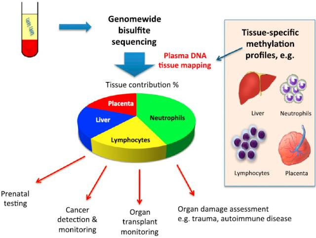
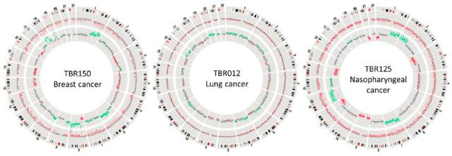
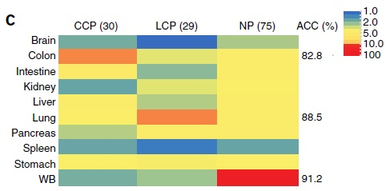

# 液体活检之甲基化测序技术{#methylation-technology}

第9期，我们将对液体活检的甲基化测序技术进行介绍，期望使您熟悉该领域的发展情况。

## 人类基因组DNA甲基化概览

面对精妙复杂的多细胞生命，我们不得不由衷赞叹造物主的神奇。那些细胞本共享一套相同的基因组，却因表观遗传信息，获得了不同命运，进而演绎出美丽的生命乐章。甲基化信息，正是表观遗传信息中最灵动的一个音符。

<font color="red">人类DNA甲基化主要指人基因组序列逾2800万个CpG双核苷酸位点上，胞嘧啶第五个C原子的甲基共价键结合修饰。</font>这些CpG双核甘酸位点在基因组中的分布并不均匀，大部分基因组区域是低CpG区域。CpG聚集的区域称之为CpG岛，许多基因的启动子区域富含CpG岛，该区域DNA的甲基化会抑制基因表达。还有一部分是中度CpG区域，它们往往位于基因内，其甲基化反而和基因活性表达有关。甲基化是一种非常稳定的DNA修饰，各细胞类型携带有其独特的甲基化状态，和细胞内的基因表达一致。已有研究表明：在人类胚胎干细胞向多胚层细胞分化，以及诱导多功能干细胞再分化和重编程过程中，有甲基化状态的改变。在不同正常组织之间，新生儿和老年人之间，产前是否遭受饥荒，肿瘤组织和正常组织之间，有明显的甲基化差异。[1-3]

```{r, out.width='100%', fig.cap='通过全基因组甲基化测序得到血浆DNA组织图谱及其应用的原理示意图', fig.align='center', echo=FALSE}

```

## cfDNA甲基化测序技术助力无创产前诊断

无创产前技术可以灵敏地检测母体cfDNA中的染色体变异，然而这些变异既可能来自胎儿基因组，也可能来自母体基因组，是否可以溯源母体cfDNA的来源，从而精准判断胎儿是否有染色体变异呢？

从理论上分析，胎儿和母体基因组应该有不同的甲基化状态，卢煜明教授团队的研究表明事实如此：他们利用全基因组甲基化测序技术，依次检测了妊娠三个月、九个月以及产后二十四小时内母体血浆cfDNA的甲基化状态，同时利用该技术检测了绒毛、胎盘和血细胞甲基化状态。在构建胎儿甲基化图谱的过程中，作者首先利用胎儿和母体基因组中的SNP差异位点（母体纯合，而胎儿杂合）来确定来自胎儿的cfDNA片段，然后将这些片段组装为胎儿甲基化组。利用1Mb基因组区域内的甲基化密度做指标，发现胎儿基因组呈低甲基化状态，这与绒毛和胎盘组织的甲基化状态相似。而胎儿以外的共有cfDNA片段大部分来自于母体，其甲基化状态和母体血细胞类似。如果胎儿染色体倍性发生异常，它们释放到母体cfDNA 中的量也会异常，进而影响到母体cfDNA中该染色体的甲基化密度。假设胎儿为3条21号染色体异常，则cfDNA中21号染色体的甲基化密度会降低。该方法有效解决了无创产前技术中假阳性的干扰。[4] 

## cfDNA甲基化测序技术在肿瘤诊断和早筛中的应用

肿瘤组织和正常组织相比，有明显的甲基化水平差异，那么在肿瘤患者和健康人的cfDNA中，是否也有明显的甲基化水平差异？如果有，我们则可以进一步利用cfDNA甲基化测序技术进行肿瘤的诊断，甚至肿瘤的早筛。

卢煜明教授的团队进行了该问题的研究。研究者们检测了肝癌患者和健康人cfDNA的全基因组甲基化状态，同样将1Mb基因组区域划分为一个bin，以其甲基化密度做指标，通过比较两者相同bin内的甲基化密度，发现肝癌患者34.1%的bins是低甲基化的（低于3个甲基化位点），而健康人则没有如此低甲基化的bin。 以1.1%的低甲基化bins为临界值，肝癌患者的检测灵敏度为81%，特异性为94%。进一步的肿瘤组织和正常组织的甲基化检测验证了该方法的可靠性。特别地，作者利用甲基化分子标记来检测肿瘤患者CNAs(Copy Number Aberrations)变异，进一步利用CNAs的变异来作为肿瘤的诊断指标。以0.68% bins 是否有CNAs为临界值，肿瘤检测灵敏度为81%，特异性为88%。接着，作者将甲基化和CNAs这两个指标结合起来，肿瘤检测的灵敏度和特异性分别达到了92%和88%。最后，作者将该方法应用到其他癌种的检测，依然有非常高的检测准确性。该结果和肿瘤组织的甲基化研究结果相符：肿瘤组织和正常组织相比，其甲基化程度明显降低。[5]

```{r, out.width='100%', fig.cap='三名患有乳腺癌，肺癌和鼻咽癌的代表性患者的血浆低甲基化和CNA分析。 内圈和外圈分别显示CNA和甲基化的z得分。 每个点代表一个1-Mb的bin。对于CNA分析，绿色，红色和灰色点分别表示具有染色体增加、缺失和正常染色体剂量。对于甲基化分析，红色和灰色点分别表示具有和不具有低甲基化的残基。 两条平行线之间的距离表示z分数差为5。从图上可以看出，三种癌症分别具备不同的CNA和甲基化模式。', fig.align='center', echo=FALSE}

```

cfDNA甲基化测序技术在肿瘤检测中的结果如此出色，是否可以将该技术应用到肿瘤早筛领域？在肿瘤早筛中，我们不仅希望得知是否有肿瘤病变发生，并且想进一步知道，究竟是哪个组织或器官发生了肿瘤病变，该信息具有重要临床意义。该问题是cfDNA组织溯源问题，同样可以用甲基化测序技术解决，这已在无创产前、器官移植等研究中得到验证。[6]

最近张鹍教授团队利用基因组相邻CpG位点共甲基化的现象，在全基因组范围内确定了近14.8万个甲基化单倍体型模块，并进一步通过定义甲基化单倍体型负荷的特征来定量分析每个甲基化单倍体型模块的甲基化模式。进一步在模块水平进行了组织特异的甲基化分析，进而利用这些组织特异的甲基化模块特征定量分析了肿瘤患者cfDNA的组织来源，利用10个以上的模块特征，其预测肺癌、结直肠癌和健康人的准确性分别达到82.8%、88.5%和91.2%。[7]

```{r, out.width='100%', fig.cap='在张鹍教授团队的研究中，该技术预测肺癌、结直肠癌和健康人的准确性分别达到82.8%、88.5%和91.2%', fig.align='center', echo=FALSE}

```

## 小结与展望

近年来，随着全基因组甲基化和简化基因组甲基化技术的全面开展，我们获得了一系列正常组织和肿瘤组织的甲基化测序结果。既有从甲基化密度上整体分析甲基化特征，也有从临近CpG位点共甲基化位点模块分析甲基化特征，同时还有许多从单碱基水平上分析甲基化特征。在全基因组水平，甲基化特征如大海，如何从其中挑选出与我们的研究高度相关的关键特征，至关重要。另外，全基因组甲基化测序受其测序深度限制，在检测cfDNA时，很难达到单碱基水平的分辨率。在寻找到一些特异甲基化区域特征后，我们可以进一步利用简化基因组甲基化测序技术，进行超高深度测序，从而在更高分辨率水平来研究甲基化特征。同时，我们需要的甲基化特征也是和我们的研究密切相关的，如果做肿瘤早筛，甲基化密度特征就非常适合，和健康人相比，肿瘤患者cfDNA 甲基化密度的改变是各癌种共有的现象。如果进一步进行ctDNA 组织溯源，则需要更多的肿瘤组织特异性甲基化特征。

随着技术的进步和研究的深入，cfDNA甲基化技术在肿瘤早筛和诊断等领域，一定会获得突破性进展和临床上的广泛应用。我们将不再谈癌色变，不再感叹人生无常，在更长的时间维度上重塑生命的意义。

## 参考文献{#ref .unnumbered}
1. Stirzaker C, Taberlay PC, Statham AL, Clark SJ: Mining cancer methylomes: prospects and challenges. Trends Genet 2013,30(2):75–84
2. Heyn H, Li N, Ferreira HJ, Moran S, Pisano DG, Gomez A, Diez J, Sanchez-Mut JV, Setien F, Carmona FJ, Puca AA, Sayols S, Pujana MA, Serra-Musach J, Iglesias-Platas I, Formiga F, Fernandez AF, Fraga MF, Heath SC, Valencia A, Gut IG, Wang J, Esteller M: Distinct DNA methylomes of newborns and centenarians. Proc Natl Acad Sci U S A 2012, 109:10522–10527.
3. Tobi EW, Goeman JJ, Monajemi R, Gu H, Putter H, Zhang Y, et al. DNA methylation signatures link prenatal famine exposure to growth and metabolism. Nat Commun. 2014;5:5592.
4. Lun FMF, et al. (2013) Noninvasive prenatal methylomic analysis by genomewide bisulfite sequencing of maternal plasma DNA. Clin Chem 59(11):1583–1594.
5. Chan KCA, et al. (2013) Noninvasive detection of cancer-associated genome-wide hypomethylation and copy number aberrations by plasma DNA bisulfite sequencing. Proc Natl Acad Sci USA 110(47):18761–18768.
6. Sun K, Jiang P, Chan KC, et al. Plasma DNA tissue mapping by genome-wide methylation sequencing for noninvasive prenatal, cancer, and transplantation assessments. Proc Natl Acad Sci USA 2015;112:E5503–12
7. Shicheng Guo, Dinh Diep, Nongluk Plongthongkum, Ho-Lim Fung, Kang Zhang  Kun Zhang（2017）Identification of methylation haplotype blocks aids in deconvolution of heterogeneous tissue samples and tumor tissue-of-origin mapping from plasma DNA. Nature Genetics : advance online.
